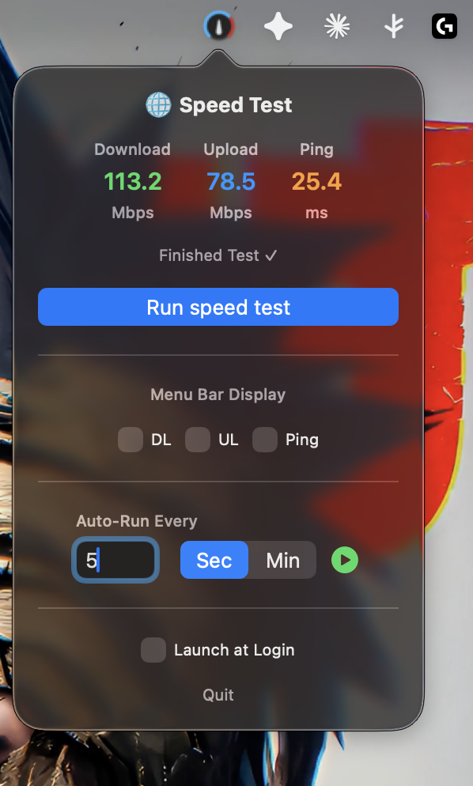
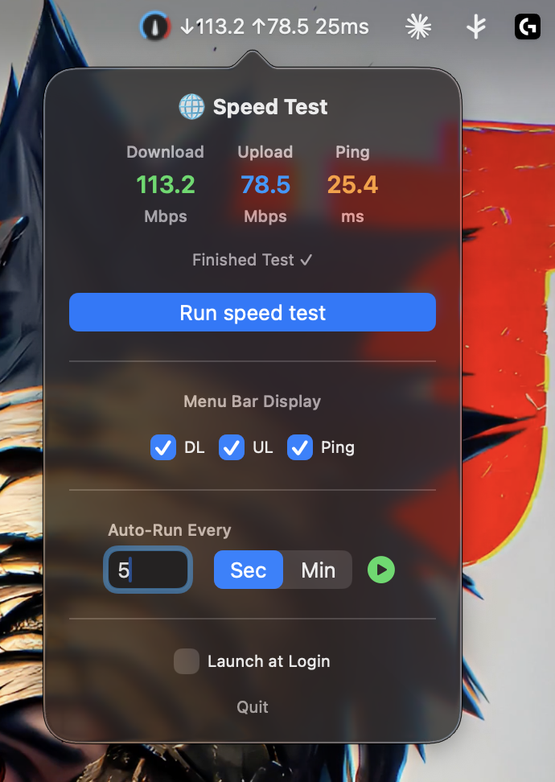

# SpeedTestBar 🌐

A lightweight macOS menu bar app that lets you test your internet speed with a single click — right from your menu bar.


---

## Features

- **Menu Bar App** — lives quietly in your menu bar, always accessible
- **Download Speed** — measures download speed in Mbps
- **Upload Speed** — measures upload speed in Mbps
- **Ping / Latency** — measures network latency in ms
- **Powered by Cloudflare** — uses Cloudflare's speed test infrastructure for accurate results
- **Lightweight** — no Dock icon, minimal resource usage

---

## Screenshots

Normal View                |  Detailed View
:-------------------------:|:-------------------------:
    |  

---

## Requirements

- macOS 12.0 or later
- Apple Silicon or Intel Mac
- Xcode 14+ (for building from source)

---

## Installation

### Option 1 — Build from Source

1. Clone the repository:
   ```bash
   git clone https://github.com/bogdanandreifilip/SpeedTestBar.git
   ```
2. Open `SpeedTestBar.xcodeproj` in Xcode
3. Select your Team in **Signing & Capabilities**
4. Build & Run with `Cmd + R`

### Option 2 — Direct Install

1. Download the latest `SpeedTestBar.app` from [Releases](../../releases)
2. Right-click the app → **Open** (required on first launch for unsigned apps)
3. Move to `/Applications` folder

### Auto-start on Login

1. Go to **System Settings → General → Login Items**
2. Click **+** and select `SpeedTestBar.app`

---

## How It Works

SpeedTestBar measures your internet speed by:

- **Ping** — sends multiple small requests to `speed.cloudflare.com` and calculates the minimum round-trip time
- **Download** — downloads a 25MB file from Cloudflare and calculates throughput
- **Upload** — uploads a 10MB payload and calculates throughput

All measurements are done natively in Swift using `URLSession` — no third-party dependencies.

---

## Project Structure

```
SpeedTestBar/
├── SpeedTestBarApp.swift    # App entry point
├── AppDelegate.swift        # Menu bar setup & popover management
├── ContentView.swift        # SwiftUI UI for the popover
├── SpeedTestService.swift   # Cloudflare speed test logic
└── Assets.xcassets          # App icons & assets
```

---

## Built With

- [Swift](https://swift.org/) — Apple's programming language
- [SwiftUI](https://developer.apple.com/xcode/swiftui/) — Declarative UI framework
- [Cloudflare Speed Test](https://speed.cloudflare.com) — Speed test backend

---

## License

This project is licensed under the MIT License — see the [LICENSE](LICENSE) file for details.

---

## Contributing

Pull requests are welcome! For major changes, please open an issue first to discuss what you would like to change.

---

*Made with ❤️ using Swift & SwiftUI*
